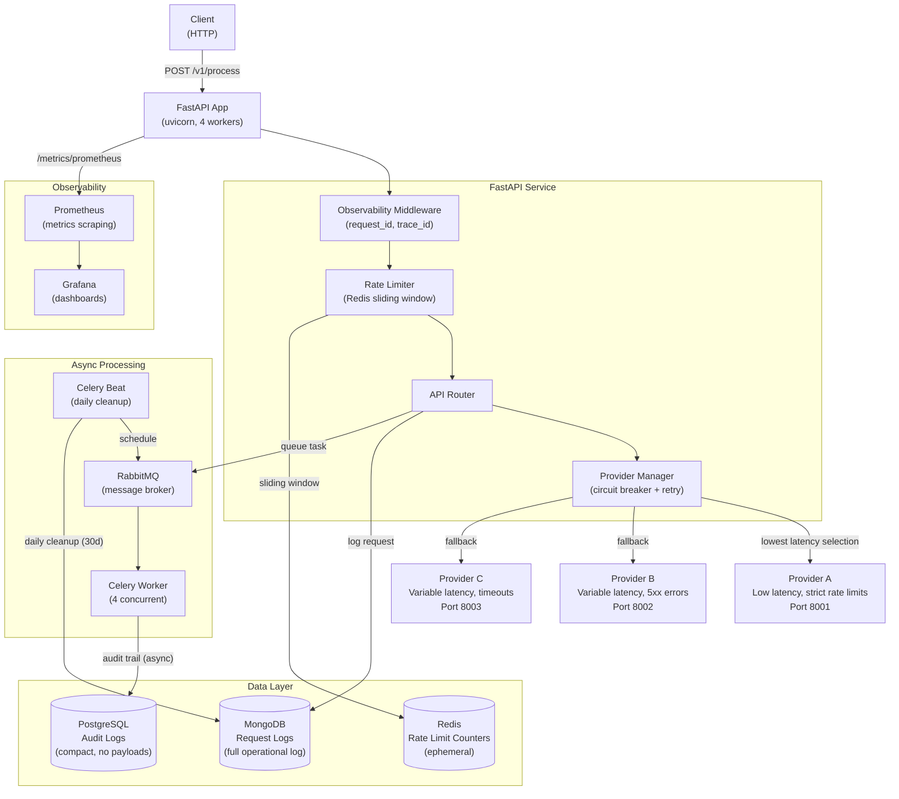
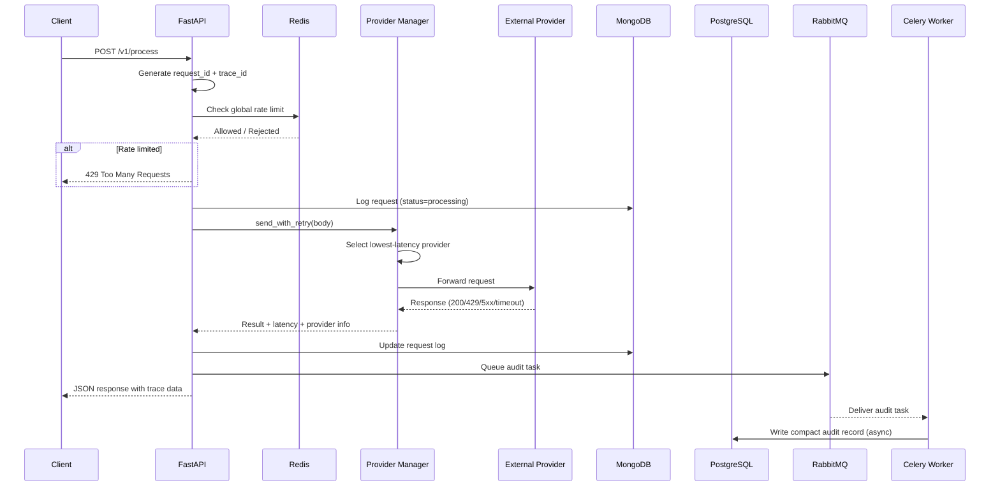

# Proxy Service

A production-grade API proxy service that ingests requests, routes them to external mock providers, and stores request/result metadata. Built with FastAPI, featuring circuit breakers, rate limiting, distributed tracing, and dual-database persistence.

## Architecture Diagram



## Data Flow



## Setup & Running

### Prerequisites

- Docker and Docker Compose v2+
- Python 3.12+ (for local development/benchmarking)

### Quick Start

```bash
# Clone and start all services
git clone <repo-url>
cd proxy-service
docker compose up -d

# Verify services are running
docker compose ps
```

### Service Endpoints

| Service | URL | Purpose |
|---------|-----|---------|
| API | `http://localhost:8000` | Proxy service |
| Health | `http://localhost:8000/health` | Basic health check |
| Provider Health | `http://localhost:8000/v1/health` | Provider circuit breaker status |
| Metrics | `http://localhost:8000/v1/metrics/prometheus` | Prometheus metrics |
| Prometheus | `http://localhost:9090` | Metrics dashboard |
| Grafana | `http://localhost:3000` (admin/admin) | Visualization |
| RabbitMQ | `http://localhost:15672` (guest/guest) | Message queue management |
| MongoDB | `mongodb://localhost:27017` | Request logs |
| PostgreSQL | `postgresql://localhost:5432` | Compact audit logs |

### API Usage

```bash
# Process a request
curl -X POST http://localhost:8000/v1/process \
  -H "Content-Type: application/json" \
  -d '{"action": "process", "data": {"key": "value"}}'

# Check request status
curl http://localhost:8000/v1/status/{request_id}

# View request history
curl http://localhost:8000/v1/history?limit=50

# Check provider health
curl http://localhost:8000/v1/health
```

## Benchmarking

### Running Benchmarks

```bash
# Install dependencies
pip install -r requirements.txt

# Run benchmark (ensure service is running)
python benchmark.py http://localhost:8000
```

### Benchmark Scenarios

| Scenario | Requests | Concurrency | Expected Behavior |
|----------|----------|-------------|-------------------|
| Light load | 100 | 10 | Baseline latency measurement |
| Medium load | 500 | 50 | Moderate throughput test |
| High load | 1,000 | 100 | Stress test with rate limiting |
| Peak load | 2,000 | 200 | Maximum throughput test |

### Expected Benchmark Results

> **Note:** Results depend on external provider latency characteristics. Provider A returns 300-1000ms, Providers B/C return 1000-10000ms with intermittent failures.

| Metric | Light (100) | Medium (500) | High (1K) | Peak (2K) |
|--------|-------------|--------------|-----------|-----------|
| RPS | ~15-30 | ~10-25 | ~8-20 | ~5-15 |
| Avg Latency | 200-500ms | 300-800ms | 400-1200ms | 500-2000ms |
| P95 Latency | 800-1500ms | 1000-3000ms | 1500-5000ms | 2000-8000ms |
| Error Rate | <1% | 1-5% | 2-8% | 5-15% |

### Output

Results are saved to `benchmark_results.json` with full latency percentiles and error breakdowns.

## Architecture Overview

### Technology Rationale

| Technology | Purpose | Why Chosen |
|------------|---------|------------|
| **FastAPI** | API framework | Async support, auto-docs, high performance |
| **MongoDB** | Full operational logs | Schema flexibility, write performance, aggregation pipeline |
| **PostgreSQL** | Compact audit trail (no payloads) | ACID compliance, relational integrity, query power |
| **Redis** | Rate limiting | Atomic operations, sliding window support, low latency |
| **Celery + RabbitMQ** | Async tasks | Reliable queue, retry handling, beat scheduling |
| **Prometheus + Grafana** | Observability | Industry standard, rich dashboards |

### Key Components

1. **Provider Manager**: Routes requests to the lowest-latency available provider using circuit breakers
2. **Rate Limiter**: Redis-based sliding window algorithm for global and per-provider rate limiting
3. **Observability Middleware**: Attaches request_id/trace_id to every request, tracks Prometheus metrics
4. **Dual Persistence**: MongoDB keeps the full operational log (headers/body/response) for debugging, history and metrics; PostgreSQL keeps only a compact, immutable audit record (no payloads), written asynchronously via Celery

## Trade-offs & Known Bottlenecks

### Trade-offs Made

| Decision | Rationale | Trade-off |
|----------|-----------|-----------|
| **MongoDB + PostgreSQL** | MongoDB stores the full operational log; PostgreSQL stores a compact audit trail written asynchronously | Higher infrastructure cost; two data stores to operate |
| **In-memory circuit breaker** | Simple, no external dependency for circuit state | State lost on restart; not shared across instances |
| **Synchronous provider calls** | Simpler code, easier debugging | Higher latency per request vs. parallel provider probing |
| **Single Celery worker pool** | Shared across all task types | Slow tasks can block fast ones |
| **Sliding window rate limiting** | Accurate count vs. fixed window | Higher Redis memory usage |

### Known Bottlenecks

1. **External provider latency**: Primary bottleneck. Provider B/C can add 1-10s per request.
2. **Connection pooling**: httpx client defaults may need tuning for >1K RPS sustained load.
3. **MongoDB write contention**: High write volume may cause lock contention without sharding.
4. **Single event loop**: FastAPI's single event loop limits CPU-bound work (not an issue for I/O-bound proxy).

## Scaling Strategy (1K to 10K RPS)

### Horizontal Scaling

```yaml
# docker-compose.yml additions for scaling
services:
  app:
    deploy:
      replicas: 4  # Scale to 4 instances behind load balancer
  
  celery-worker:
    deploy:
      replicas: 8  # Scale workers independently
```

### Infrastructure Changes

| Scale | Architecture Changes |
|-------|---------------------|
| **1K RPS** | Current setup; 4 uvicorn workers + 4 celery workers |
| **3K RPS** | Add app replicas (4→8); MongoDB replica set; Redis Cluster |
| **5K RPS** | Kubernetes deployment; horizontal pod autoscaling; PostgreSQL read replicas |
| **10K RPS** | MongoDB sharding; Redis Cluster (6+ nodes); dedicated connection pools; request coalescing |

### Specific Optimizations

1. **Connection Pooling**: Increase `max_connections` in httpx client; use connection pool per provider
2. **Request Coalescing**: Batch identical requests to reduce provider load
3. **Caching**: Add Redis cache layer for repeated request patterns (TTL-based)
4. **MongoDB Sharding**: Shard on `timestamp` or `provider_used` for write distribution
5. **Read Replicas**: PostgreSQL read replicas for `/history` and `/metrics` endpoints
6. **Load Balancer**: HAProxy or nginx in front of multiple FastAPI instances

### Persistence Strategy

| Database | Retention | Partitioning | Backup |
|----------|-----------|--------------|--------|
| MongoDB | 30 days (Celery cleanup) | Time-based indexes | Daily snapshots |
| PostgreSQL | 90 days (audit requirement) | Table partitioning by month | Continuous WAL archiving |
| Redis | Ephemeral (window-based) | N/A | None needed |

## Project Structure

```
proxy-service/
├── app/
│   ├── main.py              # FastAPI app + lifespan
│   ├── config.py             # Pydantic settings
│   ├── models/
│   │   ├── schemas.py        # Pydantic models
│   │   ├── database.py       # MongoDB operations
│   │   └── postgres.py       # PostgreSQL audit logs
│   ├── routers/
│   │   └── api.py            # API endpoints
│   ├── services/
│   │   └── provider_manager.py # Circuit breaker + retry
│   ├── tasks/
│   │   ├── celery_app.py     # Celery configuration
│   │   └── worker.py         # Async tasks
│   └── utils/
│       ├── observability.py  # Middleware + metrics
│       └── rate_limiter.py   # Redis rate limiting
├── tests/                    # Unit + integration tests
├── docker-compose.yml        # Full stack orchestration
├── Dockerfile                # App container
├── benchmark.py              # Load testing tool
├── requirements.txt          # Python dependencies
├── prometheus.yml            # Metrics scraping config
└── README.md                 # This file
```

## Development

```bash
# Install dev dependencies
pip install -r requirements.txt

# Run tests
pytest tests/ -v

# Run specific test file
pytest tests/test_provider_manager.py -v
```
